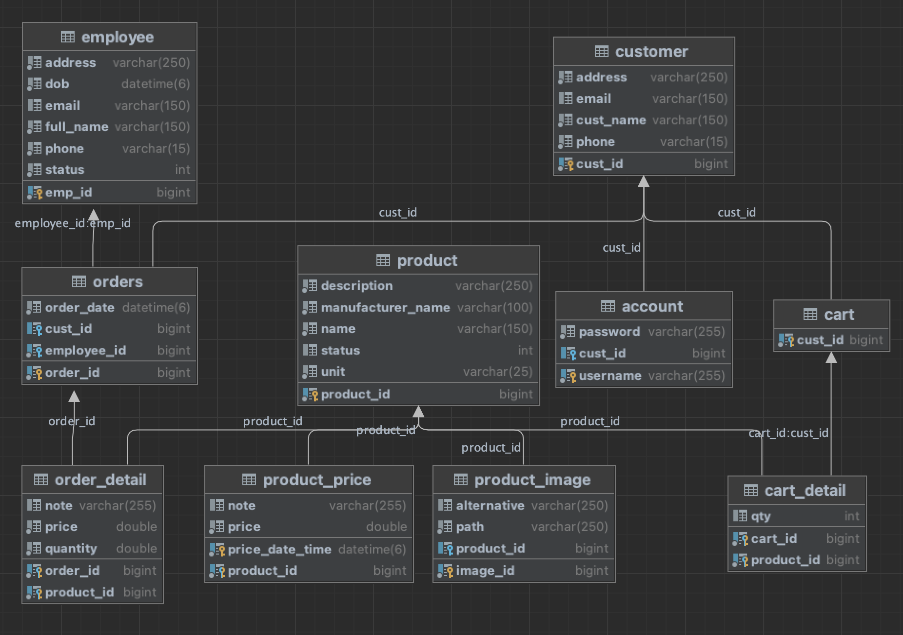
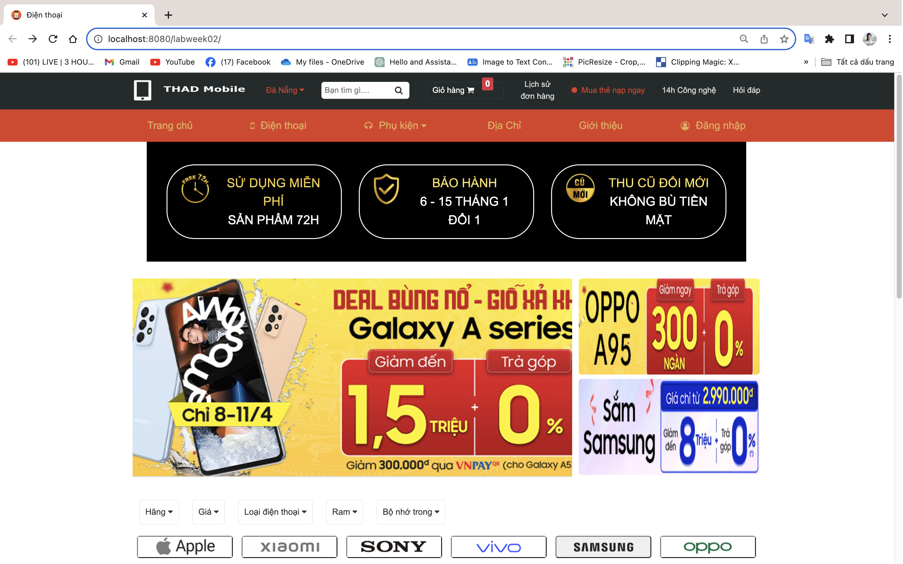
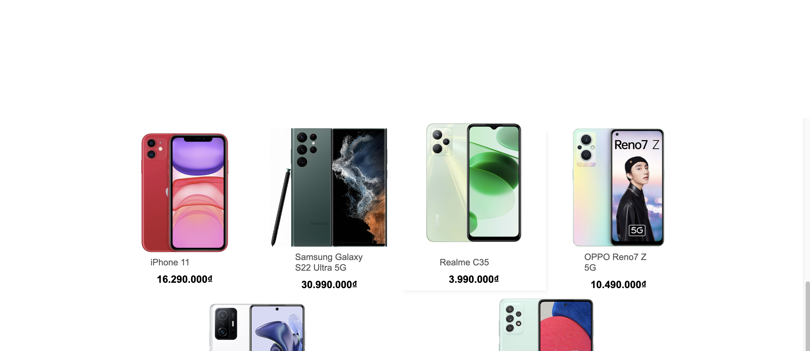
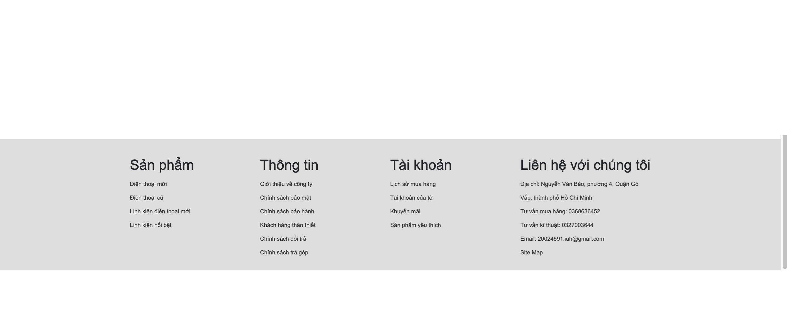
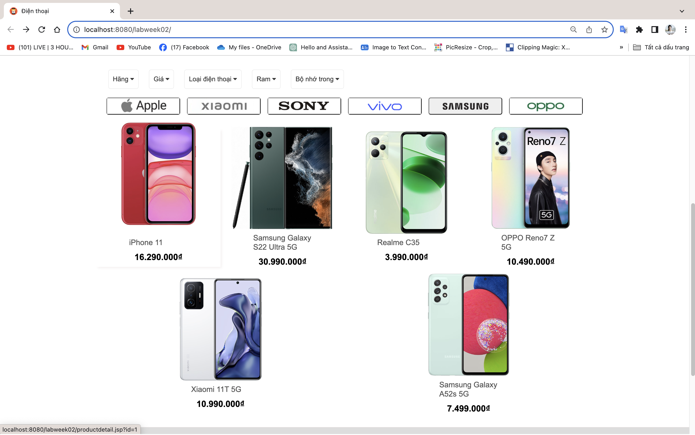
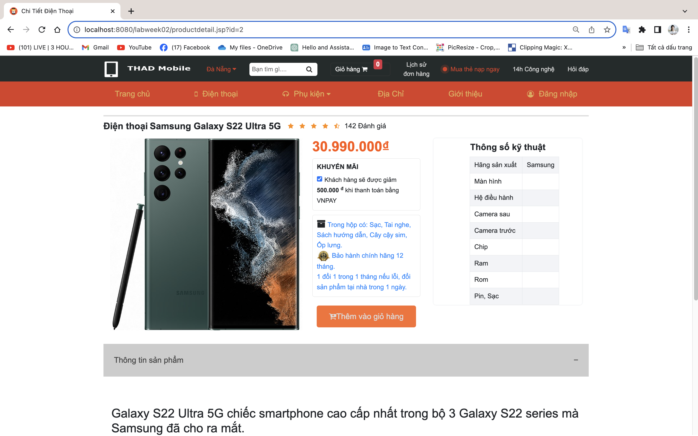
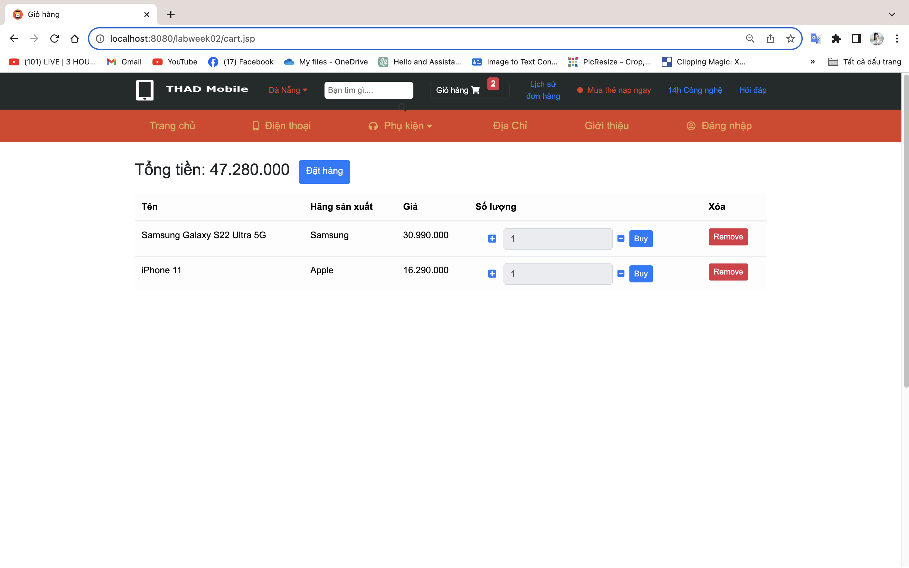
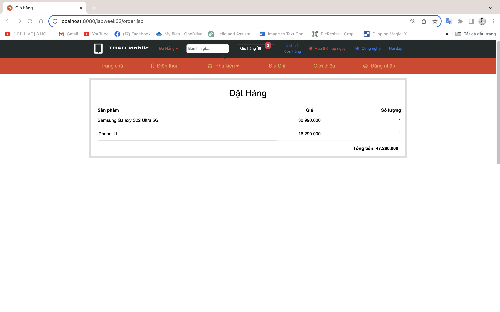
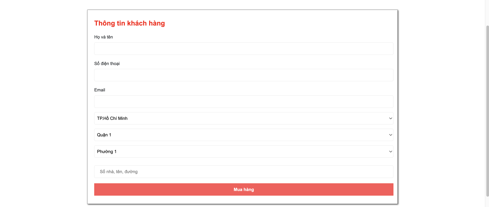
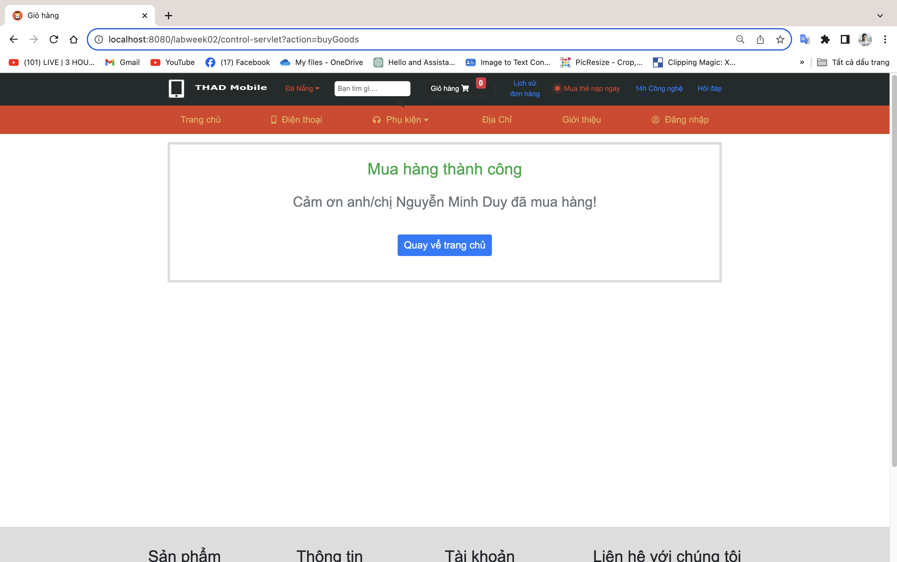

Create E-commerce website selling phones and accessories

# Backend
<ul style="list-style-type:circle; text-align: justify; line-height: 1.5;">
  <li>Creating an API for an e-commerce website.</li>      
  <li>Use: CRUD JPA, Rest API.</li>
  <li>Description: Creating web pages for product display, adding to cart, and checkout.</li>
</ul>

# Database relationship diagram

# HomePage

# ListProductPage

# ProductDetailPage

# CartPage

# OrderPage or CheckoutPage

# SuccessfulPurchasePage

